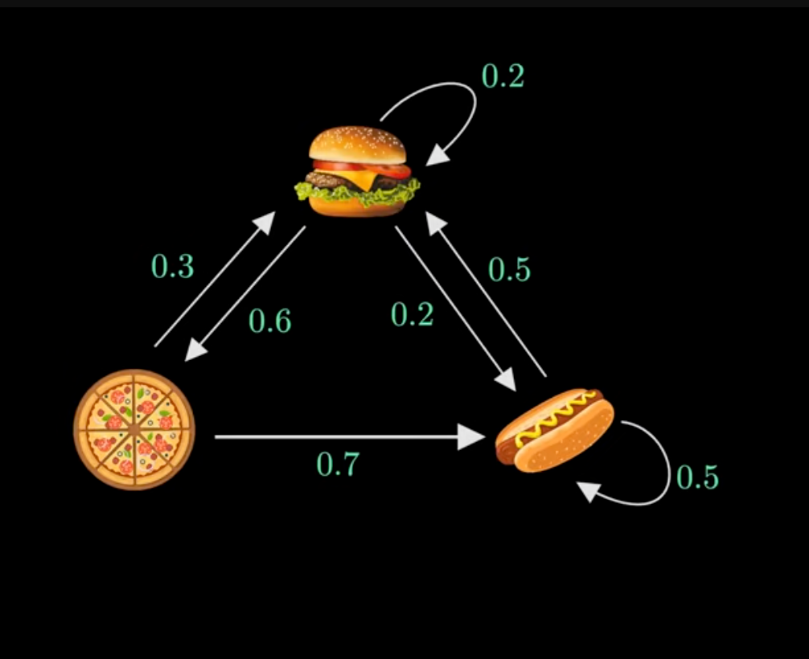

TOPIC: Markov Chains

Future state depends only on the current state, NOT the states before.

Properties:
- Markov Property: "memoryless", future state depends only on the one immediately before it

Analogy: 
A restaurant serves either Pizza, Burgers, or Hot Dogs on a given day. But what they give depends on what they gave
the previous day. For example, there is a 60% chance tomorrow Pizza if today was Burger.
Diagram: 
- arrow originates from current state and points to future state ("state" term is convention).
- Can have self-pointing arrow (eg. chance of serving burgers again given they served it today)
- Each arrow is called a transition between states
- Diagram with all possible transitions --> "Markov Chain"

Feynman