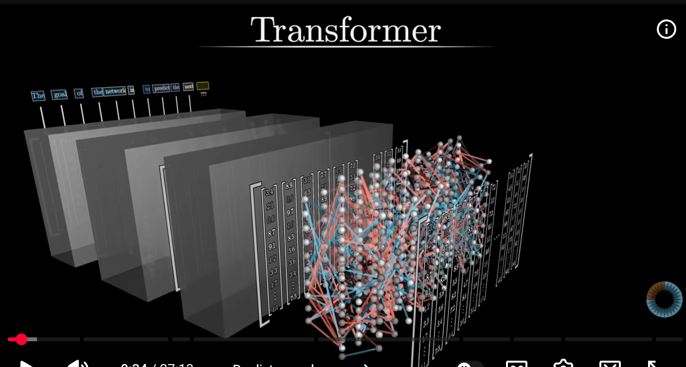

Transformers
https://www.youtube.com/watch?v=eMlx5fFNoYc&t=155s (3b1b)

GPT - generative pre-trained transformer.
    Transformer is a specific type of neural network

Trasformers. goal is to take in piece of text and predict what word comes next

TOKENIZATION
Input text is broekn into toekns. which is essentially pieces of words

first step in tranfoerm to assign each toekn a high dimensional vector (embedding). corresponds with semantic meaning.

Transfoemr progressively adjusts the embeddings so that they have richer contextual meaning (attention mechanism)

